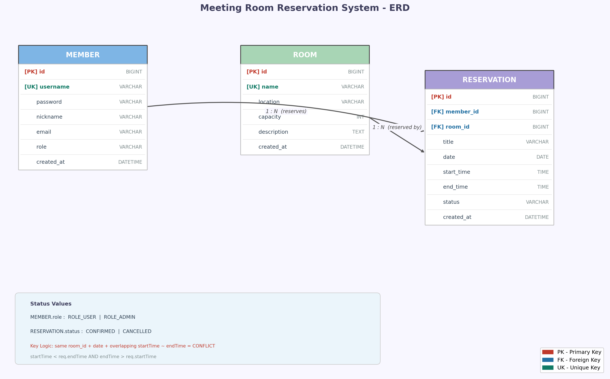

# Meeting API

JWT 기반 인증과 비관적 락을 활용한 회의실 예약 관리 RESTful API 서버입니다.  
Spring Boot와 Oracle DB를 기반으로 구축하였으며, Docker Compose로 손쉽게 실행할 수 있습니다.

---

## 기술 스택

| 분류 | 기술 |
|------|------|
| **Backend** | Java 17, Spring Boot 4.1.0, Spring Data JPA |
| **Security** | Spring Security 6, JWT (jjwt 0.11.5) |
| **Database** | Oracle XE 21c |
| **Infra** | Docker, Docker Compose |
| **Docs** | Swagger UI (springdoc-openapi 2.8.0) |

---

## 주요 기능

- **회원 인증** — 회원가입 / 로그인 (JWT 발급)
- **회의실 관리** — 회의실 목록·상세 조회 (관리자: 등록·수정·삭제)
- **예약 관리** — 예약 신청 / 취소, 내 예약 목록 조회
- **가능한 회의실 조회** — 날짜·시간 조합 기반 예약 가능 회의실 반환
- **동시성 처리** — 비관적 락(PESSIMISTIC_WRITE)으로 중복 예약 방지
- **관리자 기능** — 전체 예약·회원 현황 조회, 회의실별 예약 통계

---

## 프로젝트 구조

```
src/main/java/com/meeting/meetingapi/
├── config/          # SecurityConfig, SwaggerConfig, AppConfig
├── controller/      # Auth, Room, Reservation, Admin
├── domain/
│   ├── entity/      # Member, Room, Reservation
│   └── enums/       # MemberRole, ReservationStatus
├── dto/
│   ├── request/     # RegisterRequest, LoginRequest, RoomRequest, ReservationRequest
│   └── response/    # LoginResponse, RoomResponse, ReservationResponse, Admin*Response
├── exception/       # CustomException, GlobalExceptionHandler, ErrorResponse
├── repository/      # Spring Data JPA Repositories
├── security/        # JwtTokenProvider, JwtAuthenticationFilter, UserDetailsServiceImpl
└── service/         # AuthService, RoomService, ReservationService, AdminService
```

---

## API 엔드포인트

### 인증 (`/api/auth`)

| 메서드 | 엔드포인트 | 설명 | 권한 |
|--------|-----------|------|------|
| `POST` | `/api/auth/register` | 회원가입 | 없음 |
| `POST` | `/api/auth/login` | 로그인 (JWT 발급) | 없음 |

### 회의실 (`/api/rooms`)

| 메서드 | 엔드포인트 | 설명 | 권한 |
|--------|-----------|------|------|
| `GET` | `/api/rooms` | 회의실 목록 조회 | 없음 |
| `GET` | `/api/rooms/{id}` | 회의실 상세 조회 | 없음 |
| `GET` | `/api/rooms/available` | 예약 가능한 회의실 조회 | 없음 |
| `GET` | `/api/rooms/{roomId}/reservations` | 특정 회의실 날짜별 예약 현황 | 없음 |
| `POST` | `/api/rooms` | 회의실 등록 | ADMIN |
| `PUT` | `/api/rooms/{id}` | 회의실 수정 | ADMIN |
| `DELETE` | `/api/rooms/{id}` | 회의실 삭제 | ADMIN |

> `GET /api/rooms/available` 파라미터: `date` (필수), `startTime` (선택), `endTime` (선택)

### 예약 (`/api/reservations`)

| 메서드 | 엔드포인트 | 설명 | 권한 |
|--------|-----------|------|------|
| `GET` | `/api/reservations` | 내 예약 목록 조회 | USER |
| `POST` | `/api/reservations` | 예약 신청 | USER |
| `DELETE` | `/api/reservations/{id}` | 예약 취소 | USER |

### 관리자 (`/api/admin`) — ADMIN 전용

| 메서드 | 엔드포인트 | 설명 |
|--------|-----------|------|
| `GET` | `/api/admin/reservations` | 전체 예약 현황 (날짜·회의실 필터, 페이징) |
| `GET` | `/api/admin/reservations/today` | 오늘 예약 현황 |
| `GET` | `/api/admin/members` | 전체 회원 목록 (페이징) |
| `GET` | `/api/admin/rooms/stats` | 회의실별 예약 통계 |

---

## 주요 구현 포인트

### 1. JWT 인증 방식

로그인 성공 시 `username`과 `role` 클레임을 담은 JWT를 발급합니다 (HMAC-SHA256, 유효 24시간).  
이후 요청은 `Authorization: Bearer <token>` 헤더를 통해 인증하며, `JwtAuthenticationFilter`가 매 요청마다 토큰을 검증하고 `SecurityContext`에 사용자 정보를 주입합니다.

### 2. `@Transactional` + 비관적 락을 통한 동시성 처리

예약 신청 시 `SELECT ... FOR UPDATE` (비관적 락)로 회의실 레코드를 조회하여 동시 예약 요청으로 인한 중복 예약을 방지합니다.

```java
// RoomRepository
@Lock(LockModeType.PESSIMISTIC_WRITE)
@Query("SELECT r FROM Room r WHERE r.id = :id")
Optional<Room> findByIdWithLock(@Param("id") Long id);
```

### 3. 시간 겹침 체크 쿼리

`startTime < :endTime AND endTime > :startTime` 조건으로 한쪽이라도 겹치는 예약을 탐지합니다.

```java
@Query("SELECT r FROM Reservation r WHERE r.room.id = :roomId AND r.date = :date " +
       "AND r.status = 'CONFIRMED' AND r.startTime < :endTime AND r.endTime > :startTime")
List<Reservation> findOverlapping(...);
```

### 4. 예약 가능 회의실 조회 파라미터 분기

입력 조합에 따라 서비스 레이어에서 분기하여 각각 다른 JPQL NOT IN 서브쿼리를 실행합니다.

```
date 만          → 해당 날짜 예약 없는 회의실 반환
date + startTime → startTime 이후 끝나는 예약 없는 회의실 반환
date + startTime + endTime → 시간대 겹침 없는 회의실 반환
endTime 만       → 400 Bad Request
```

### 5. `ROLE_ADMIN` 권한 처리

Spring Security의 `@PreAuthorize("hasRole('ADMIN')")` 어노테이션으로 관리자 엔드포인트를 보호합니다. `AdminController` 클래스 레벨에 선언하여 모든 관리자 API에 일괄 적용합니다.

---

## 실행 방법

### 환경 변수 설정

프로젝트 루트에 `.env` 파일을 생성합니다.

```env
DB_URL=jdbc:oracle:thin:@meeting-oracle:1521/XEPDB1
DB_USERNAME=system
DB_PASSWORD=your_password
JWT_SECRET=your_jwt_secret_key_at_least_32_characters
```

### Docker Compose로 실행

```bash
docker-compose up --build
```

Oracle DB가 정상 기동된 후 API 서버가 자동으로 연결됩니다 (`healthcheck` 설정으로 순서 보장).

### Swagger UI 접속

```
http://localhost:8080/swagger-ui.html
```

로그인 후 발급받은 JWT를 우측 상단 **Authorize** 버튼에 입력하면 인증이 필요한 API를 바로 테스트할 수 있습니다.

---

## ERD


