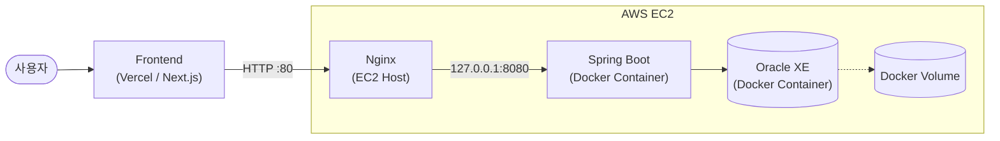
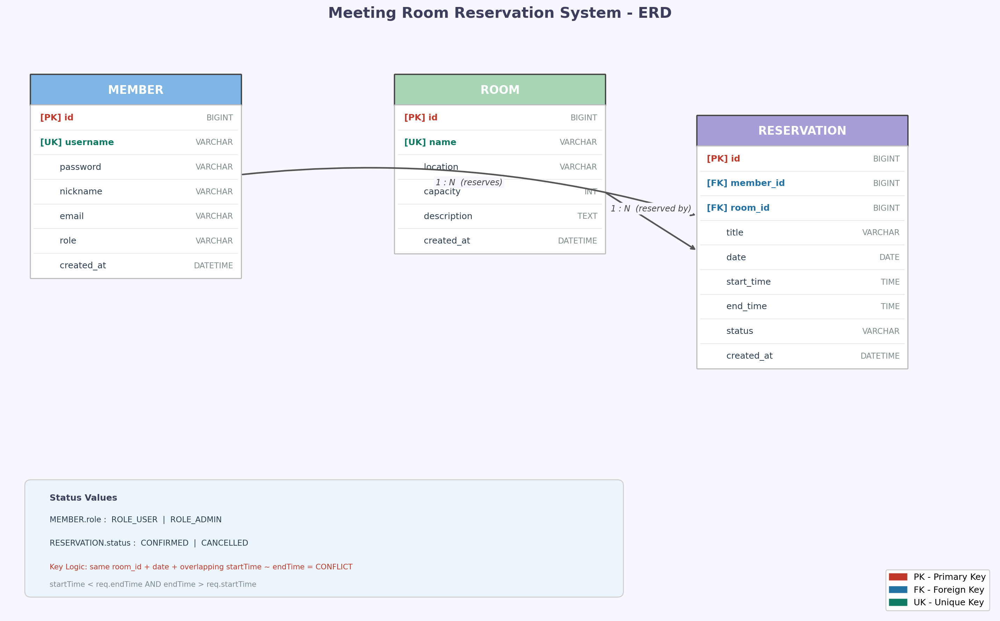

# Meeting API

동시 예약 제어부터 배포·모니터링까지, 실제 서비스 운영 환경을 가정해 고도화한 Spring Boot 기반 회의실 예약 REST API 서버입니다.

단순 예약 CRUD에서 시작해 동시 예약 문제 해결, 표준화된 예외 처리, 운영 로그, 테스트 자동화, Docker 실행 환경, CI/CD, AWS 배포, Health Check와 장애 감지까지 단계적으로 확장했습니다. 이 문서는 그 과정에서 무엇을 왜 해결했고 어떻게 검증했는지를 중심으로 정리했습니다.

---

## 1. 프로젝트 소개

- JWT 기반 인증/인가를 적용한 회의실 예약 API 서버
- 동일 회의실·동일 시간대에 대한 동시 예약 요청을 비관적 락으로 직렬화하고, 멀티스레드 테스트로 직접 검증
- 예외를 코드/메시지/HTTP Status로 표준화하고, 비즈니스 이벤트·예외를 로그로 남겨 운영 중 문제를 추적할 수 있도록 구성
- Docker Compose로 Spring Boot + Oracle을 함께 실행할 수 있고, GitHub Actions에서 테스트 → AWS 배포까지 자동화된 CI/CD 파이프라인을 구축·검증
- Spring Boot Actuator Health Check를 Docker healthcheck와 배포 파이프라인에 연동

## 2. 주요 기능

- **회원 인증** — 회원가입 / 로그인 (JWT 발급)
- **회의실 조회** — 목록 조회, 상세 조회, 날짜·시간 조건에 맞는 예약 가능 회의실 조회
- **회의실 관리(ADMIN)** — 등록 / 수정 / 삭제 (확정된 예약이 있는 회의실은 삭제 불가)
- **예약 관리** — 예약 신청 / 수정 / 취소, 내 예약 목록 조회
- **회의실별 예약 현황 조회** — 특정 회의실의 날짜별 확정 예약 목록
- **관리자 기능** — 전체 예약 조회(날짜·회의실 필터 + 페이징), 오늘 예약 현황, 전체 회원 목록(페이징), 회의실별 예약 통계(누적/이번 달)

> 예약 수정 API(`PUT /api/reservations/{id}`)는 초기 버전 이후 추가된 기능으로, 본인 예약만 수정 가능하며 시간 겹침·과거 날짜 검증을 생성 로직과 동일하게 적용합니다.

## 3. 기술 스택

| 분류 | 기술 |
|------|------|
| **Backend** | Java 17, Spring Boot 4.1.0, Spring Data JPA |
| **Security** | Spring Security 6, JWT (jjwt 0.11.5) |
| **Database** | Oracle XE 21c |
| **Test** | JUnit 5, Spring Boot Test, MockMvc, AssertJ |
| **Infra** | Docker, Docker Compose |
| **CI/CD** | GitHub Actions, AWS EC2, GitHub OIDC(IAM Role), AWS Systems Manager(SSM Run Command) |
| **Health Check** | Spring Boot Actuator |
| **API Docs** | Swagger UI (springdoc-openapi 2.8.0) |
| **Monitoring** | AWS CloudWatch, CloudWatch Synthetics, SNS *(AWS 콘솔에서 구성·검증한 운영 경험이며, 이 저장소의 코드에는 포함되어 있지 않습니다 — 4·13장 참고)* |

## 4. 시스템 아키텍처

AWS 환경에서 실제로 배포하고 운영을 검증했던 구조입니다.


```mermaid
flowchart LR
    User(["사용자"]) --> FE["Frontend<br/>(Vercel / Next.js)"]
    FE -->|"HTTP :80"| Nginx

    subgraph EC2["AWS EC2"]
        Nginx["Nginx<br/>(EC2 Host)"] -->|"127.0.0.1:8080"| API["Spring Boot<br/>(Docker Container)"]
        API --> DB[("Oracle XE<br/>(Docker Container)")]
        DB -.-> VOL[("Docker Volume")]
    end
```

- Nginx는 Docker 컨테이너가 아니라 EC2 Host에 직접 설치되어 80번 포트를 수신하고, `127.0.0.1:8080`으로 Spring Boot 컨테이너에 리버스 프록시합니다.
- Spring Boot와 Oracle만 Docker Compose로 실행했으며, Oracle 데이터는 Docker Volume으로 유지했습니다.
- 이미지 레지스트리(ECR)는 사용하지 않았고, EC2 내부에서 `git pull` 후 직접 `docker compose up -d --build`로 빌드했습니다.

> **현재 상태**: AWS 기반 배포 및 운영 검증을 완료했으며, 현재는 비용 절감을 위해 AWS 인프라 운영을 종료했습니다. 위 구조는 배포 검증 당시의 아키텍처이며, 현재 운영 중인 서비스는 아닙니다.

## 5. 동시성 제어

같은 회의실·같은 시간대에 예약 요청이 동시에 들어오면, 단순히 "겹치는 예약이 있는지 조회 후 없으면 저장"하는 방식은 **조회와 저장 사이의 시간차(Race Condition)** 때문에 두 요청 모두 겹치지 않는다고 판단해 중복 예약이 생성될 수 있습니다.

이를 막기 위해 예약 생성/수정 시 대상 회의실 row에 비관적 락을 걸어, 동일 회의실에 대한 동시 요청을 DB 레벨에서 직렬화합니다.

```java
// RoomRepository
@Lock(LockModeType.PESSIMISTIC_WRITE)
@Query("SELECT r FROM Room r WHERE r.id = :id")
Optional<Room> findByIdWithLock(@Param("id") Long id);
```

락을 획득한 뒤에는 시간 겹침 여부를 조회해 하나라도 겹치면 거부합니다.

```java
// ReservationRepository
WHERE r.room.id = :roomId AND r.date = :date AND r.status = 'CONFIRMED'
  AND r.startTime < :endTime AND r.endTime > :startTime
```

`startTime < 요청 endTime AND endTime > 요청 startTime` 조건으로, 두 시간 구간이 조금이라도 겹치면 충돌로 판단합니다.

## 6. 동시성 테스트

`ReservationConcurrencyTest`에서 실제 Oracle DB에 연결한 Spring Boot 통합 테스트로 위 로직을 검증합니다.

- 10개의 Thread가 같은 회의실·같은 시간대에 `CountDownLatch`로 동시에 예약을 요청
- 검증 결과
  - 성공 1건
  - 예약 충돌(`CustomException`)로 인한 실패 9건
  - 예상하지 못한 예외 0건
  - 테스트 종료 후 DB에 남은 확정(`CONFIRMED`) 예약 1건

10개 요청 중 정확히 1건만 성공하고 나머지는 정상적인 충돌 예외로 처리되는지를 매 실행마다 검증하며, 비관적 락이 실제 DB 위에서 의도대로 동작함을 확인하는 근거로 사용하고 있습니다.

## 7. 예외 처리 표준화

`exception` 패키지에서 `CustomException` / `ErrorCode` / `ErrorResponse` / `GlobalExceptionHandler`로 예외 처리를 표준화했습니다.

- `ErrorCode`: enum 하나에 `HttpStatus`와 사용자 메시지를 함께 관리 (예: `RESERVATION_TIME_CONFLICT(HttpStatus.CONFLICT, "해당 시간에 이미 예약이 있습니다.")`)
- `CustomException`: `ErrorCode`만 들고 던지는 런타임 예외
- `GlobalExceptionHandler`(`@RestControllerAdvice`): `CustomException`, `AccessDeniedException`, `DataIntegrityViolationException`, 그 외 미처리 예외까지 모두 동일한 형식으로 응답 변환

단순 문자열 예외 메시지 대신 `ErrorCode`를 도입한 이유는, HTTP Status와 비즈니스 에러 코드·메시지를 한 곳에서 관리해 프론트엔드가 `code` 값만으로 분기 처리할 수 있게 하고, 새로운 에러 케이스가 생겨도 enum 값 하나만 추가하면 되도록 하기 위해서입니다.

```json
{
  "code": "RESERVATION_TIME_CONFLICT",
  "message": "해당 시간에 이미 예약이 있습니다."
}
```

`ApiErrorResponseTest`는 MockMvc로 실제 HTTP 요청을 보내 다음 4가지 대표 케이스의 Status Code와 응답 Body를 검증합니다.

- 존재하지 않는 회의실 조회 → `404 ROOM_NOT_FOUND`
- 잘못된 아이디/비밀번호 로그인 → `401 INVALID_CREDENTIALS`
- 예약 시간 겹침 → `409 RESERVATION_TIME_CONFLICT`
- 타인의 예약 취소 시도 → `403 RESERVATION_ACCESS_DENIED`

## 8. 운영 로그

운영 환경에서 어떤 요청이 왜 실패했는지 추적할 수 있도록, `AuthService`/`RoomService`/`ReservationService`/`GlobalExceptionHandler`/`JwtTokenProvider`에 로그를 남겼습니다.

- **INFO** — 회원가입 완료, 로그인 성공, 회의실 생성/수정/삭제 완료, 예약 생성/수정/취소 완료, 그리고 **예약 시간 충돌**(정상적으로 예상되는 비즈니스 실패이므로 INFO)
- **WARN** — 로그인 실패, 권한 없는 예약 수정/취소 시도, 유효하지 않은 JWT 토큰 검증 실패(`JwtTokenProvider`), `@PreAuthorize` 권한 거부로 발생하는 `AccessDeniedException`(`GlobalExceptionHandler`)
- **ERROR** — `GlobalExceptionHandler`가 그 외 처리하지 못한 예외를 잡았을 때, 스택 트레이스와 함께 기록

`CustomException` 자체는 `GlobalExceptionHandler`에서 표준 에러 응답으로만 변환할 뿐 별도로 로그를 남기지 않습니다. 위 INFO/WARN 로그는 예외를 던지기 직전 Service 계층에서 상황별로 남긴 것이며, 그 밖의 `CustomException`(예: 존재하지 않는 리소스 조회 등)은 별도 로그 없이 표준 에러 응답만 반환됩니다. "같은 실패라도 예상 가능한 비즈니스 실패(INFO/WARN)와 예상하지 못한 서버 오류(ERROR)를 레벨로 구분"하는 데 초점을 맞췄습니다.

## 9. 테스트

`src/test`에는 총 **26개**의 테스트가 있으며, 전부 `@SpringBootTest` 기반으로 **실제 Oracle DB에 연결하는 통합 테스트**입니다(H2 등 인메모리 DB로 대체하지 않음). 로컬/CI 모두 Oracle 컨테이너가 떠 있어야 실행할 수 있습니다.

| 클래스 | 개수 | 검증 범위 |
|---|---|---|
| `AuthServiceTest` | 3 | 회원가입 중복 검증, 비밀번호 인코딩, 로그인/토큰 발급 |
| `RoomServiceTest` | 3 | 회의실 이름 중복, 활성 예약 있는 회의실 삭제 방지, 정상 삭제 |
| `ReservationServiceTest` | 14 | 예약 생성/수정/취소의 정상 케이스와 시간 검증, 권한, 상태 전이 등 예외 케이스 |
| `ReservationConcurrencyTest` | 1 | 10-Thread 동시 예약 요청 (6장 참고) |
| `ApiErrorResponseTest` | 4 | MockMvc 기반 HTTP 레벨 표준 에러 응답 (7장 참고) |
| `MeetingApiApplicationTests` | 1 | Spring Context 정상 로딩 |

테스트 프레임워크는 JUnit 5 + AssertJ이며, HTTP 레벨 테스트는 `spring-boot-starter-webmvc-test`의 `MockMvc`를 사용합니다. GitHub Actions `test` Job에서도 동일하게 Oracle 서비스 컨테이너를 띄운 뒤 `./mvnw test`를 실행해, push/PR마다 이 26개 테스트가 자동으로 돌아가도록 구성했습니다(12장 참고).

```bash
docker compose up -d oracle   # 테스트용 Oracle 기동
./mvnw test
```

## 10. Docker

**Dockerfile**은 2단계(Multi-stage) 빌드로 구성했습니다.

- 빌드 스테이지: `eclipse-temurin:17-jdk-alpine` + `./mvnw package -DskipTests`
- 런타임 스테이지: `eclipse-temurin:17-jre-alpine`에 `curl`만 추가 설치(Health Check용) 후 빌드 산출물 jar만 복사해 실행

**docker-compose.yml**은 `oracle`, `meeting-api` 두 서비스로 구성됩니다.

- `oracle`(gvenzl/oracle-xe:21-slim): `1521:1521` 포트 바인딩, `healthcheck.sh` 기반 healthcheck, `oracle-data` Docker Volume으로 데이터 유지
- `meeting-api`: `oracle`이 `service_healthy` 상태가 될 때까지 대기(`depends_on: condition: service_healthy`) 후 기동, `127.0.0.1:8080:8080`으로 로컬 전용 포트 바인딩, `curl -f http://localhost:8080/actuator/health` 기반 healthcheck
- 환경변수(`DB_URL`, `DB_USERNAME`, `DB_PASSWORD`, `JWT_SECRET`, `FRONTEND_URL`)는 프로젝트 루트의 `.env` 파일로 주입합니다(`.env`는 git에 커밋되지 않으며, `.env.example`에 예시가 있습니다).

## 11. Health Check

Spring Boot Actuator를 도입하고, `management.endpoints.web.exposure.include=health` 로 **`/actuator/health` 하나만** 외부에 노출하도록 제한했습니다(`show-details`/`show-components`도 `never`로 설정해 세부 컴포넌트 정보 없이 최소한의 상태만 노출). `SecurityConfig`에서도 `/actuator/health`만 명시적으로 `permitAll()` 처리했고, 그 외 Actuator 엔드포인트는 열려 있지 않습니다.

Health Check는 두 곳에서 사용됩니다.

1. **Docker Container Health Check** — `docker-compose.yml`의 `meeting-api` healthcheck가 `/actuator/health`를 주기적으로 확인
2. **배포 완료 검증(CI/CD)** — GitHub Actions 배포 단계에서 `docker compose up -d --build` 성공 후, Spring Boot가 요청을 받을 준비가 됐는지 Nginx를 경유한 `http://localhost/actuator/health`로 확인

애플리케이션 초기 기동 시간(JPA 스키마 초기화 등)을 고려해, 배포 스텝에서는 **5초 간격으로 최대 12회(최대 60초)** 재시도하고, 그래도 응답이 없으면 `exit 1`로 SSM Command 자체를 실패 처리하는 fail-fast 구조로 되어 있습니다(12장 참고).

## 12. CI/CD

`.github/workflows/ci.yml`은 `test` → `deploy` 두 Job으로 구성됩니다.

```
GitHub Push / PR
  └─ test: Oracle 서비스 컨테이너 기동 → ./mvnw test
       └─ (main push일 때만, test 성공 후) deploy:
            GitHub OIDC로 AWS IAM Role 인증
              → AWS Systems Manager(SSM) Run Command로 EC2에 명령 전달
              → EC2에서 git pull --ff-only
              → docker compose up -d --build
              → /actuator/health 재시도(최대 60초) 검증
              → 성공/실패 결과를 SSM 명령 조회로 출력
```

- **AWS 인증**: 장기 Access Key/Secret Key를 GitHub에 저장하지 않고, GitHub Actions OIDC로 발급받은 토큰으로 AWS IAM Role을 임시로 위임받는 방식(`aws-actions/configure-aws-credentials`)입니다.
- **배포 방식**: SSH로 접속해 명령을 실행하는 방식이 아니라, `AWS-RunShellScript` 문서를 사용하는 **SSM Run Command**로 EC2에 셸 명령을 전달합니다(EC2 내부에서 직접 빌드하는 구조는 4장 참고).
- **fail-fast**: `git pull`과 `docker compose up -d --build`를 하나의 셸 컨텍스트에서 `&&`로 연결해, 앞 단계가 실패하면 이후 Health Check 단계로 넘어가지 않고 즉시 배포 실패로 처리됩니다.
- AWS 계정/리소스를 식별하는 값(Role ARN, EC2 Instance ID)은 코드에 하드코딩하지 않고 GitHub Actions Variables(`AWS_ROLE_ARN`, `EC2_INSTANCE_ID`)로 주입합니다.

> GitHub OIDC + SSM 기반의 이 CI/CD 구조는 AWS 환경에서 실제로 구축하고 배포까지 검증했습니다. 현재는 비용 절감을 위해 AWS 인프라 운영을 종료해 배포 대상 인프라가 존재하지 않으며, 이 workflow는 당시 검증한 배포 구조를 기록·증빙하기 위해 저장소에 유지하고 있습니다.

## 13. 모니터링 및 장애 알림

> 아래 내용은 AWS 콘솔에서 직접 구성하고 검증했던 운영 경험이며, 이 저장소의 소스 코드에는 포함되어 있지 않습니다.

- **Infrastructure Monitoring**: EC2의 `StatusCheckFailed` 지표를 CloudWatch Alarm에 연결하고, SNS를 통해 이메일로 알림을 받도록 구성했습니다.
- **Application Monitoring**: CloudWatch Synthetics Canary가 Nginx를 거쳐 외부 사용자 요청 경로와 동일하게 `GET /actuator/health`를 주기적으로 호출하고, 실패 시 CloudWatch Alarm → SNS 이메일로 알림이 가도록 구성했습니다.

Spring Boot Actuator와 CloudWatch Synthetics를 연계해 외부 사용자 관점의 애플리케이션 상태를 주기적으로 확인하고, EC2 `StatusCheckFailed` 지표로 인프라 장애를 감지하는 구조를 만들었습니다. 실제로 EC2를 중지시켜 Synthetics Canary가 실패(SuccessPercent 0%)하는 것과 SNS 이메일 알림 수신을 확인했고, EC2를 재기동해 Canary가 다시 정상(SuccessPercent 100%)으로 돌아오는 것까지 검증했습니다.

## 14. 주요 문제 해결

### 동시 예약 Race Condition

- **문제**: 예약 가능 여부 조회와 예약 저장 사이에 다른 요청이 끼어들면, 두 요청 모두 "겹치지 않는다"고 판단해 동일 시간에 중복 예약이 생성될 수 있음
- **해결**: 예약 생성/수정 시 대상 Room row에 `PESSIMISTIC_WRITE` 락을 적용해 동일 회의실에 대한 동시 요청을 직렬화
- **검증**: 10-Thread 동시 예약 테스트 → 성공 1건 / 충돌 실패 9건 / 예상 못한 예외 0건

### 배포 성공 여부 판단

- **문제**: `docker compose up -d --build` 명령이 성공해도, Spring Boot 애플리케이션이 실제로 요청을 받을 준비가 됐는지는 별개의 문제
- **해결**: Spring Boot Actuator `/actuator/health`를 추가하고, 배포 후 Nginx를 경유해 이 엔드포인트를 재시도 방식으로 확인 (재시도 조건은 11장 참고)
- **검증**: 재시도 끝까지 응답이 없으면 `exit 1`로 배포 자체를 실패 처리

### 배포 자동화 보안

- **문제**: 장기 AWS Access Key를 GitHub Secrets에 저장하지 않고 EC2에 배포하고 싶음
- **해결**: GitHub Actions OIDC로 AWS IAM Role을 임시로 위임받고, SSH 대신 AWS SSM Run Command로 EC2에 배포 명령을 전달

## 15. API 엔드포인트

### 인증 (`/api/auth`)

| Method | Endpoint | Description | Authorization |
|---|---|---|---|
| POST | `/api/auth/register` | 회원가입 | 없음 |
| POST | `/api/auth/login` | 로그인 (JWT 발급) | 없음 |

### 회의실 (`/api/rooms`)

| Method | Endpoint | Description | Authorization |
|---|---|---|---|
| GET | `/api/rooms` | 회의실 목록 조회 | 없음 |
| GET | `/api/rooms/{id}` | 회의실 상세 조회 | 없음 |
| GET | `/api/rooms/available` | 예약 가능한 회의실 조회 (`date` 필수, `startTime`/`endTime` 선택) | 없음 |
| GET | `/api/rooms/{roomId}/reservations` | 특정 회의실 날짜별 확정 예약 현황 (`date`) | 없음 |
| POST | `/api/rooms` | 회의실 등록 | ADMIN |
| PUT | `/api/rooms/{id}` | 회의실 수정 | ADMIN |
| DELETE | `/api/rooms/{id}` | 회의실 삭제 (확정 예약이 있으면 거부) | ADMIN |

### 예약 (`/api/reservations`)

| Method | Endpoint | Description | Authorization |
|---|---|---|---|
| GET | `/api/reservations` | 내 예약 목록 조회 | USER |
| POST | `/api/reservations` | 예약 신청 | USER |
| PUT | `/api/reservations/{id}` | 예약 수정 (본인 예약만) | USER |
| DELETE | `/api/reservations/{id}` | 예약 취소 (본인 예약만) | USER |

### 관리자 (`/api/admin`) — ADMIN 전용

| Method | Endpoint | Description |
|---|---|---|
| GET | `/api/admin/reservations` | 전체 예약 현황 (날짜·회의실 필터, 페이징) |
| GET | `/api/admin/reservations/today` | 오늘 예약 현황 |
| GET | `/api/admin/members` | 전체 회원 목록 (페이징, 회원별 예약 건수 포함) |
| GET | `/api/admin/rooms/stats` | 회의실별 누적/이번 달 예약 통계 |

## 16. Security

`SecurityConfig` 기준으로 인증/인가는 다음과 같이 구성되어 있습니다.

- `SessionCreationPolicy.STATELESS` + JWT 기반 인증이므로 CSRF는 비활성화했습니다.
- `JwtAuthenticationFilter`가 `UsernamePasswordAuthenticationFilter`보다 앞단에서 `Authorization: Bearer <token>` 헤더를 검증하고, 유효하면 `SecurityContext`에 인증 정보를 채웁니다.
- URL 단위로 인증 없이 허용(`permitAll`)한 경로: `/api/auth/**`, `/swagger-ui/**`, `/v3/api-docs/**`, `/actuator/health`
- `/api/reservations/**`, `/api/admin/**`는 SecurityConfig에서 `authenticated()`(로그인 필요)로 지정했습니다.
- 회의실 등록/수정/삭제(`/api/rooms` POST·PUT·DELETE)와 `/api/admin/**` 전체는 `@PreAuthorize("hasRole('ADMIN')")`로 ADMIN 권한을 요구합니다.
- 본인 예약인지 여부(예약 수정/취소)는 URL 권한이 아니라 `ReservationService`에서 로그인한 사용자와 예약자를 직접 비교해 검증합니다. 즉 "로그인 여부/역할"은 Spring Security가, "이 리소스가 내 것인가"는 서비스 로직이 검증하는 구조입니다.
- CORS는 `app.cors.allowed-origins` 프로퍼티(`localhost:3000`, `localhost:5173` + 환경변수 `FRONTEND_URL`)로 허용 Origin을 관리하며, `Authorization`/`Content-Type` 헤더와 `GET/POST/PUT/DELETE/OPTIONS` 메서드만 허용합니다.

## 17. 실행 방법

1. 저장소 clone
2. `.env.example`을 참고해 프로젝트 루트에 `.env` 생성 (실제 비밀번호/Secret은 임의의 값으로 채우세요)

   ```env
   DB_USERNAME=system
   DB_PASSWORD=change-me
   JWT_SECRET=change-me-please-use-a-strong-secret-key-min-32-chars
   ```

3. Docker Compose로 실행

   ```bash
   docker compose up -d --build
   ```

4. 컨테이너 상태 확인

   ```bash
   docker compose ps
   ```

5. Health Check 확인

   ```bash
   curl http://localhost:8080/actuator/health
   ```

6. Swagger UI 접속 후 API 확인 (18장 참고)

> 종료할 때는 `docker compose down`을 사용하세요. `docker compose down -v`는 Oracle 데이터가 담긴 Docker Volume까지 삭제하므로, 데이터를 유지하고 싶다면 사용하지 마세요.

## 18. Swagger / API Docs

springdoc-openapi 기반 Swagger UI를 제공합니다.

```
http://localhost:8080/swagger-ui.html
```

`SwaggerConfig`에서 `bearerAuth`(HTTP Bearer, JWT) 보안 스키마를 등록해 두었으므로, `/api/auth/login`으로 발급받은 토큰을 Swagger UI 우측 상단 **Authorize** 버튼에 입력하면 인증이 필요한 API도 바로 테스트할 수 있습니다.

## 19. ERD

`docs/meeting_api_erd.png`의 `Member` / `Room` / `Reservation` 테이블 구조와 컬럼은 현재 엔티티(`Member.java`, `Room.java`, `Reservation.java`)와 일치함을 확인했습니다.



## 20. Frontend Repository

[https://github.com/kimgywls/meeting-web](https://github.com/kimgywls/meeting-web)
